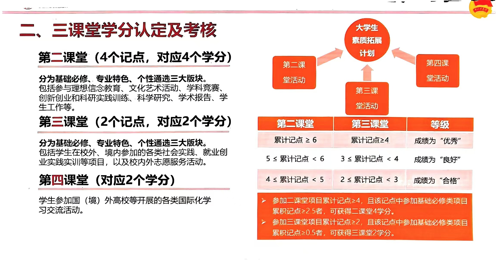
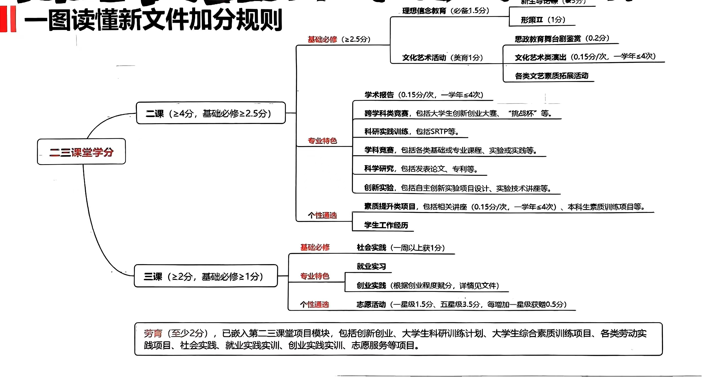

# **二三四课分**

二三四课分介绍可详见学生手册，或者参考 [https://mini-full.github.io/zju-welcome/learning/concepts/#_5](https://mini-full.github.io/zju-welcome/learning/concepts/#_5)

二三课堂学分需要到素拓网上申请**（一定要记得去申请，具体流程详见在素拓网）**

素拓网网页端：[浙江大学大学生素质拓展数智平台](http://sztz.zju.edu.cn/dekt/#/index/main)

移动端：

